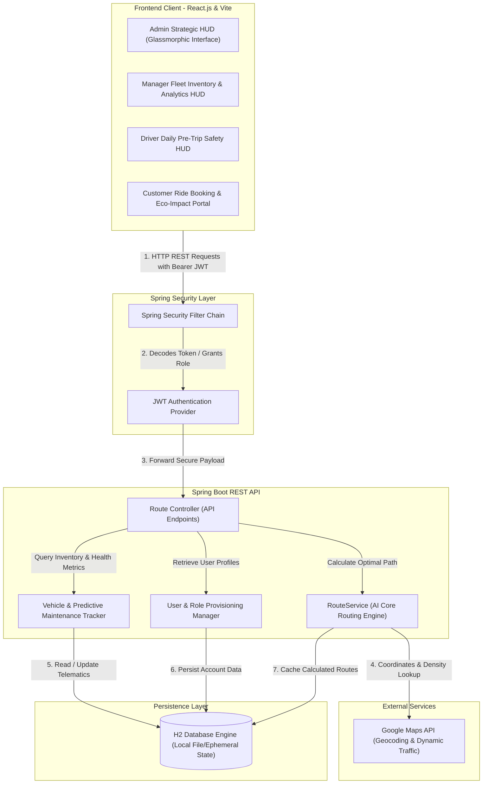

# NeuroFleetX 🚀

> **An Enterprise AI-Driven Urban Mobility & Fleet Orchestration Platform.**

NeuroFleetX is a next-generation urban mobility platform that couples real-time simulated IoT telematics with advanced geospatial route optimization models. It provides a single unified dashboard architecture targeting fleet efficiency, predictive maintenance, and sustainable transit for smart cities.

---

### 🌐 Live Production Deployment
* **Client App URL:** [https://neurofleetx-frontend.onrender.com](https://neurofleetx-frontend.onrender.com)
* **GitHub Repository:** [https://github.com/Prudhvi2206/NeurofeetX.git](https://github.com/Prudhvi2206/NeurofeetX.git)
* **Blueprint API URL:** `https://neurofleetx-api.onrender.com`

---

## 🗺️ System Architecture

NeuroFleetX utilizes a highly decoupled, state-of-the-art client-server architecture. Below is a comprehensive visual map of the platform's core runtime data flows, security boundaries, external APIs, and persistent storage:



---

## 👥 Strategic Command Center Panels (By Role)

The platform provides dedicated user dashboards optimized for their specific workflow constraints, using a responsive Glassmorphic design language:

### 1. 👑 System Admin Command HUD
* **KPI Intelligence Control Panel:** Immediate visualization of global system states, real-time organization metrics, and active security sessions.
* **Role-Based Access Control (RBAC):** Complete management capabilities over Customers, Drivers, Managers, and Admins.
* **Automated Business Reporting:** Instant generation and download of professional CSV and PDF data exports for compliance auditing.

### 2. 📊 Fleet Manager Analytics Dashboard
* **Dynamic Fleet Inventory:** Add, remove, and update assets (EVs, Vans, and Trucks) on the fly.
* **Component-Level Wear Trends:** Visual representation of predicted tire tread degradation, brake pad wear, and oil quality.
* **Interactive Telematics Charts:** Charts showing weekly vehicle speeds, fleet health metrics, and maintenance states.

### 3. 🚚 Driver Pre-Trip Safety HUD
* **Assigned Vehicle Diagnostics:** Real-time sensor metrics (brake pads, oil quality, coolant temperature, tire pressure, and battery life).
* **Pre-Trip Safety Checklist:** Standardized check protocol requiring confirmation before vehicle operation.
* **Earnings & Metrics Tracking:** Direct interface showing completed journeys, trip efficiency scores, and active payouts.

### 4. 📱 Customer Ride Booking & Eco-Impact Portal
* **Live Ride Tracking:** Seamless interface showing vehicle position and estimated time of arrival.
* **Safety Verification HUD:** Live performance indicators and technical transparency logs of the assigned ride.
* **🌱 Eco-Impact Tracker:** Real-time metrics showing total CO₂ saved compared to standard combustion vehicles, plus a green sustainability score.

---

## 🧠 AI Geospatial Routing Engine (Deep Dive)

The core routing suite utilizes classical graph theory algorithms supercharged with predictive modeling and time-dependent optimization options:

### 1. Core Graph Theory Routing
* **🔍 Dijkstra Algorithm:** Guarantees mathematically shortest pathways across mapped junctions, intersections, and road segments.
* **⭐ A\* Algorithm:** Employs coordinate-based straight-line heuristics to prune search trees, returning identical optimal paths up to **75% faster**.
* **🤖 Machine Learning Enhancement:** Adjusts edge weights based on real-time traffic density predictions, time of day (rush hour vs. normal), and vehicle performance history.

### 2. Tailored Optimization Modes
* **`A*-Traffic-Aware`:** Continuous real-time traffic congestion monitoring and dynamic rerouting to bypass bottlenecks.
* **`Greedy-Energy-Optimized`:** Optimizes energy recovery metrics through regenerative braking and terrain gradients.
* **`EV-Optimized` (Electric Vehicles):** Tracks battery state of charge (SoC) constraints and automatically integrates optimal charging station waypoints.
* **`Scenic-Route`:** Factors in historical points of interest and scenic viewpoints for luxury city tours.

### 3. Multi-Stop & Load Balancing
* **Waypoint Optimization Strategies:** Supports geographic clustering, fuel efficiency priority, and sequential waypoint optimization.
* **Intelligent Load Balancing:** Dynamic vehicle-to-route assignment maximizing throughput while minimizing fleet wear.

---

## 🛠️ Technology Stack

| Technology Layer | Tools & Libraries | Key Application |
| :--- | :--- | :--- |
| **Frontend UI Client** | React.js (Vite), Glassmorphic Theme | SPA rendering, modular UI elements |
| **Geospatial Maps** | Leaflet.js, Leaflet.heat | Real-time coordinate maps and heatmaps |
| **Analytics Engine** | Recharts, Chart.js | Telemetry graphs, speed, and wear analysis |
| **Styling Paradigm** | Modern Vanilla CSS | Lightweight layouts, zero-bulk styling |
| **Backend Core** | Spring Boot, Java 17 | Core API services, business logic, security |
| **Security Framework** | Spring Security, JWT Tokens | Decoupled state authentication |
| **Database Tier** | H2 Embedded Engine | Low-overhead local storage, file-based dev DB |
| **Infrastructure** | Docker, Render Blueprint | Zero-downtime microservice orchestration |

---

## ☁️ Cloud Deployment Blueprint (`render.yaml`)

NeuroFleetX is deployed on Render using a native **Blueprint spec** that provisions both frontend and backend microservices with automatic environment variable synchronization:

```yaml
services:
  # ── Backend: Spring Boot API (Docker) ──
  - type: web
    name: neurofleetx-api
    runtime: docker
    plan: free
    rootDir: fleetmanagement
    dockerfilePath: ./Dockerfile
    envVars:
      - key: PORT
        value: 8080
      - key: CORS_ALLOWED_ORIGINS
        sync: false          # Set to Frontend's Render URL (https://neurofleetx-frontend.onrender.com)

  # ── Frontend: React + Vite Static Site ──
  - type: web
    name: neurofleetx-frontend
    runtime: static
    rootDir: myapp
    buildCommand: npm install && npm run build
    staticPublishPath: dist
    routes:
      - type: rewrite
        source: /*
        destination: /index.html
    envVars:
      - key: VITE_API_URL
        sync: false          # Set to Backend's Render URL (https://neurofleetx-api.onrender.com)
```

---

## 🔌 REST API Reference

The backend exposes a highly optimized set of route endpoints under `/api/routes/*` for path calculations and fleet balancing:

### 1. Primary Route Optimization
* **Endpoint:** `POST /api/routes/optimize`
* **Request Body:**
  ```json
  {
    "startPoint": "Bangalore",
    "endPoint": "Mumbai"
  }
  ```
* **Response Details:**
  Calculates the AI-optimized primary route, returning distance, estimated duration, traffic density metrics, energy consumption, and algorithm parameters.

### 2. Multi-Option Alternatives
* **Endpoint:** `POST /api/routes/alternatives`
* **Request Body:**
  ```json
  {
    "startPoint": "Delhi",
    "endPoint": "Chennai",
    "numberOfAlternatives": 3
  }
  ```
* **Available Algorithms:** `A*-Traffic-Aware`, `Greedy-Energy-Optimized`, `Time-Optimized`, `Cost-Effective`, `Scenic-Route`, `Avoid-Highways`.

### 3. Intelligent EV-Specific Alternatives
* **Endpoint:** `POST /api/routes/intelligent-alternatives`
* **Request Body:**
  ```json
  {
    "startPoint": "Mumbai",
    "endPoint": "Pune",
    "vehicleType": "EV",
    "timeOfDay": "rush_hour"
  }
  ```

### 4. Multi-Stop Waypoints Optimization
* **Endpoint:** `POST /api/routes/multi-stop`
* **Request Body:**
  ```json
  {
    "startPoint": "Hyderabad",
    "endPoint": "Vijayawada",
    "waypoints": ["Warangal", "Khammam"]
  }
  ```

### 5. Platform Diagnostics & Active Monitoring
* **GET `/api/routes/route-metrics?algorithm=A*-Traffic-Aware`:** Returns avg reliability scores, fuel efficiency, and route success rates.
* **GET `/api/routes/active`:** Returns a list of vehicles currently executing optimized routes.
* **GET `/api/routes/recent`:** Fetch completed route history.

---

## 🏃 Getting Started (Local Development)

### Prerequisites
* **Java 17 (JDK)**
* **Node.js (v18+)**
* **Maven**

### 1. Start the Backend API
Navigate to the backend engine directory and boot the Spring application context:
```bash
cd fleetmanagement
./mvnw spring-boot:run
```
*The backend API server will initialize on `http://localhost:8080`*

### 2. Start the Frontend Client
Open a second terminal, install local node modules, and spin up the developer server:
```bash
cd myapp
npm install
npm run dev
```
*The React client will launch and serve on `http://localhost:5173`*

---

## 📝 License
This project is proprietary software for internal administration. All rights reserved.
